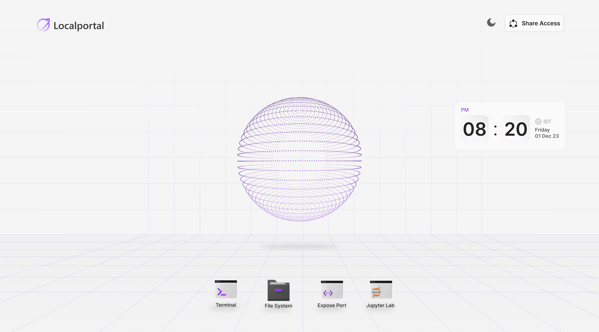

<p align="center">
  <a href="https://localportal.io">
    
  </a>
  <h1 align="center">Localportal (Opensourcing on 5000th star)</h1>
  <p align="center">
    Turn Your Local or Cloud Compute Into A Remote Workstation.
    <br />
    <br />
    <a href="https://twitter.com/localportalhq">
      
    </a>
  </p>
</p>

<br />

[](https://localportal.io)

<br />

Localportal is a stunning (pseudo) operating system designed for the AI-first world, where accessing high-performance compute is not just a necessity but a non-negotiable requirement. We are excited to announce that we will be open-sourcing the core of Localportal, the OS itself, empowering you to build and run it on any infrastructure of your choice. We also offer prebuilt versions that you can install with a single command, without the need to pay or even sign up.

```bash
curl -L https://localportal.io/install | sh
```

The Localportal ecosystem extends beyond the OS, featuring machine interface servers that connects your local or cloud computers to. This integration give you a public URL that allows you to access pseudo-desktop directly through your web browser, from anywhere in the world. We know secure collaboration is crucial advancement; in the local variant, the desktop is accessible on the multicast URL but behind password auth whereas the hosted variant allows the access through the public URL but is guarded by RBAC


## Apps

Currently, the pseudo operating system offers four powerful apps:

1. Terminal App: Open one or more terminals on your remote machines seamlessly.
2. Filesystem App: Interact with the remote filesystem as if it were your local filesystem, with the added ability to download or upload files to your machines.
3. Jupyter Notebook App: Leverage the power of Jupyter notebooks for interactive computing and data analysis.
4. Expose Port App: Expose any port from the remote machine and obtain a URL for that exposed port. In the hosted version, you have the option to put these exposed ports behind authentication if desired. By default, each exposed port is publicly accessible, but you can enable authentication for added security.

## Open Source Roadmap
We don't have a date decided. Our journey towards open-sourcing Localportal's OS is tied to community engagement. If this is a project community is not very interested in, we don't really see the value in open sourcing it either. **We will be open sourcing Localportal's OS whenever this repo reaches 5k stars**.

Join us on this exciting journey as we revolutionize the way developers interact with high-performance computing in the AI-driven world. Together, let's unlock the full potential of Localportal and shape the future of computing.

<a href="https://star-history.com/#localportal/localportal&Date">
 <picture>
   <source media="(prefers-color-scheme: dark)" srcset="https://api.star-history.com/svg?repos=localportal/localportal&type=Date&theme=dark" />
   <source media="(prefers-color-scheme: light)" srcset="https://api.star-history.com/svg?repos=localportal/localportal&type=Date" />
   
 </picture>
</a>
